### **NOTE:** This README file is a preview of the entire Exploratory Data Analysis(EDA) notebook.

-----
<br></br>

**<h1>Exploratory Data Analysis</h1>**


We'll cover EDA alongside data cleaning and feature engineering, cleaning the data as we gain insights and data trends exhibited by the data, and adding more derived features to explore the data further (eg. year feature from date columns).  
This notebook will cover the following in order:  
- **EDA and Data Cleaning**
- **Missing data imputation**
- **Feature engineering**


```python
# Import necessary libraries
import numpy as np
import pandas as pd

import matplotlib.pyplot as plt
%matplotlib inline
plt.style.use("/home/lyrax/matplotlib-dracula/dracula.mplstyle")
import seaborn as sns

from tqdm import tqdm, trange
```


```python
data = pd.read_excel("data/Claims Data 2.xlsx", parse_dates=['participant_date_of_birth', 'treatment_created_date',
                                                             'claim_finalized_date'])
data.sample(3)
```


<div>
<style scoped>
    .dataframe tbody tr th:only-of-type {
        vertical-align: middle;
    }

    .dataframe tbody tr th {
        vertical-align: top;
    }

    .dataframe thead th {
        text-align: right;
    }
</style>
<table border="1" class="dataframe">
  <thead>
    <tr style="text-align: right;">
      <th></th>
      <th>Serial Number</th>
      <th>claim_status</th>
      <th>provider_type</th>
      <th>provider_region</th>
      <th>program_type</th>
      <th>program_cover</th>
      <th>participant_date_of_birth</th>
      <th>participant_gender</th>
      <th>treatment_created_date</th>
      <th>claim_finalized_date</th>
      <th>item_status</th>
      <th>item_name</th>
      <th>item_amount</th>
      <th>item_currency</th>
      <th>item_quantity</th>
      <th>total_item_amount</th>
      <th>diagnoses</th>
      <th>treatment_type</th>
    </tr>
  </thead>
  <tbody>
    <tr>
      <th>115902</th>
      <td>164918.0</td>
      <td>Approved</td>
      <td>Clinic</td>
      <td>NAIROBI</td>
      <td>Insurance</td>
      <td>OUT-PATIENT</td>
      <td>1994-11-25</td>
      <td>MALE</td>
      <td>2021-01-22 12:51:23</td>
      <td>2021-01-26 13:48:23</td>
      <td>APPROVED</td>
      <td>Urisol satchets</td>
      <td>206.9</td>
      <td>KES</td>
      <td>1</td>
      <td>206.9</td>
      <td>Urethral disorder unspecified; Urinary tract i...</td>
      <td>OUTPATIENT</td>
    </tr>
    <tr>
      <th>12425</th>
      <td>193631.0</td>
      <td>PartiallyRejected</td>
      <td>Clinic</td>
      <td>MACHAKOS</td>
      <td>Insurance</td>
      <td>OUT-PATIENT</td>
      <td>1996-08-22</td>
      <td>MALE</td>
      <td>2021-03-09 08:45:06</td>
      <td>NaT</td>
      <td>SUBMITTED</td>
      <td>TOTAL CORPORATE SHARE</td>
      <td>6094.4</td>
      <td>KES</td>
      <td>1</td>
      <td>6094.4</td>
      <td>Encounter for administrative examination</td>
      <td>OUTPATIENT</td>
    </tr>
    <tr>
      <th>38669</th>
      <td>181814.0</td>
      <td>Approved</td>
      <td>Clinic</td>
      <td>LAIKIPIA</td>
      <td>Insurance</td>
      <td>OUTPATIENT</td>
      <td>1992-03-30</td>
      <td>FEMALE</td>
      <td>2021-02-17 14:11:07</td>
      <td>2021-02-20 09:22:55</td>
      <td>APPROVED</td>
      <td>Zyrtec 10mg tablets 10s</td>
      <td>95.2</td>
      <td>KES</td>
      <td>7</td>
      <td>666.4</td>
      <td>Acute laryngopharyngitis</td>
      <td>OUTPATIENT</td>
    </tr>
  </tbody>
</table>
</div>


```python
# shape of dataset
data.shape
```


    (170995, 18)


```python
# info
data.info()
```

    <class 'pandas.core.frame.DataFrame'>
    RangeIndex: 170995 entries, 0 to 170994
    Data columns (total 18 columns):
     #   Column                     Non-Null Count   Dtype         
    ---  ------                     --------------   -----         
     0   Serial Number              170321 non-null  float64       
     1   claim_status               170995 non-null  object        
     2   provider_type              144502 non-null  object        
     3   provider_region            167860 non-null  object        
     4   program_type               170995 non-null  object        
     5   program_cover              170995 non-null  object        
     6   participant_date_of_birth  170989 non-null  datetime64[ns]
     7   participant_gender         170989 non-null  object        
     8   treatment_created_date     170995 non-null  datetime64[ns]
     9   claim_finalized_date       154567 non-null  datetime64[ns]
     10  item_status                170995 non-null  object        
     11  item_name                  170995 non-null  object        
     12  item_amount                170995 non-null  float64       
     13  item_currency              170995 non-null  object        
     14  item_quantity              170995 non-null  int64         
     15  total_item_amount          170995 non-null  float64       
     16  diagnoses                  166207 non-null  object        
     17  treatment_type             170995 non-null  object        
    dtypes: datetime64[ns](3), float64(3), int64(1), object(11)
    memory usage: 23.5+ MB


```python
# describe on numerical columns
data.describe().T
```


<div>
<style scoped>
    .dataframe tbody tr th:only-of-type {
        vertical-align: middle;
    }

    .dataframe tbody tr th {
        vertical-align: top;
    }

    .dataframe thead th {
        text-align: right;
    }
</style>
<table border="1" class="dataframe">
  <thead>
    <tr style="text-align: right;">
      <th></th>
      <th>count</th>
      <th>mean</th>
      <th>std</th>
      <th>min</th>
      <th>25%</th>
      <th>50%</th>
      <th>75%</th>
      <th>max</th>
    </tr>
  </thead>
  <tbody>
    <tr>
      <th>Serial Number</th>
      <td>170321.0</td>
      <td>180979.114384</td>
      <td>15272.404593</td>
      <td>153482.0</td>
      <td>167801.0</td>
      <td>181048.0</td>
      <td>194170.0</td>
      <td>207225.0</td>
    </tr>
    <tr>
      <th>item_amount</th>
      <td>170995.0</td>
      <td>1603.746681</td>
      <td>2801.112576</td>
      <td>0.0</td>
      <td>170.0</td>
      <td>732.0</td>
      <td>1950.0</td>
      <td>120000.0</td>
    </tr>
    <tr>
      <th>item_quantity</th>
      <td>170995.0</td>
      <td>5.788397</td>
      <td>59.844295</td>
      <td>0.0</td>
      <td>1.0</td>
      <td>1.0</td>
      <td>1.0</td>
      <td>10000.0</td>
    </tr>
    <tr>
      <th>total_item_amount</th>
      <td>170995.0</td>
      <td>1876.772361</td>
      <td>2876.007143</td>
      <td>0.0</td>
      <td>450.0</td>
      <td>1000.0</td>
      <td>2150.0</td>
      <td>120000.0</td>
    </tr>
  </tbody>
</table>
</div>


```python
# missing data statistics as percentage
data.isnull().sum() *100 / len(data)
```


    Serial Number                 0.394164
    claim_status                  0.000000
    provider_type                15.493435
    provider_region               1.833387
    program_type                  0.000000
    program_cover                 0.000000
    participant_date_of_birth     0.003509
    participant_gender            0.003509
    treatment_created_date        0.000000
    claim_finalized_date          9.607298
    item_status                   0.000000
    item_name                     0.000000
    item_amount                   0.000000
    item_currency                 0.000000
    item_quantity                 0.000000
    total_item_amount             0.000000
    diagnoses                     2.800082
    treatment_type                0.000000
    dtype: float64


```python
plt.figure(figsize=(10,8))
sns.heatmap(data.isnull(), cbar=False, yticklabels=False)
plt.title("Missing Data Heatmap", y=1.08)
plt.tight_layout()
plt.savefig("plots/missing data heatmap.png", dpi=1000)
```


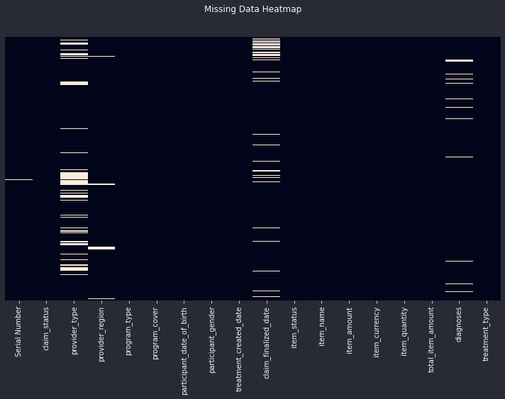


## **Univariate Analysis**
In this section we'll have one variable plots.


```python
plt.figure(figsize=(10,14))
pd.DataFrame(pd.Series(data.isnull().sum() *100 / len(data)).sort_values()[8:]).plot(kind='bar')
plt.title("Missing Data Barplot", y=1.08)
plt.tight_layout()
plt.savefig("plots/missing data barplot.png", dpi=1000)
```


    <Figure size 720x1008 with 0 Axes>


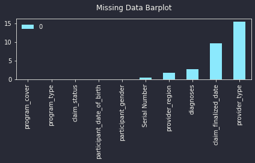


```python
# Serial number
data['Serial Number'].nunique()
```


    52187


```python
len(data)
```


    170995


Serial number column seems to be an identity column representing the customer in question.  
So the data covers information of 52187 customers.


```python
# claim status distribution
print(data.claim_status.value_counts())
plt.figure(figsize=(8,6))
sns.countplot(y=data.claim_status)
```

    Approved             153549
    Submitted              7392
    PartiallyRejected      5978
    ReSubmitted            3058
    Rejected               1018
    Name: claim_status, dtype: int64


    <AxesSubplot:xlabel='count', ylabel='claim_status'>


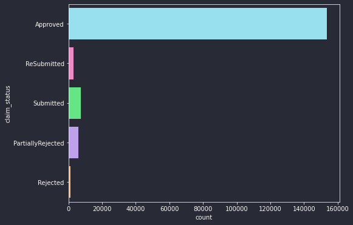


Let's mark the status as _Approved_ or _Not Approved_ as this is the information the company will ultimately require to know, whether an insurance claim is either approved or not.


```python
data.claim_status.replace(['ReSubmitted', 'Submitted', 'PartiallyRejected', 'Rejected'], 'Not Approved', inplace=True)
print(data.claim_status.value_counts(), "\nPercentages:\n", data.claim_status.value_counts(normalize=True))
plt.figure(figsize=(8,6))
sns.countplot(x=data.claim_status)

plt.title("Claim Status")
plt.tight_layout()
plt.savefig("plots/claim status distribution.png", dpi=1000)
```

    Approved        153549
    Not Approved     17446
    Name: claim_status, dtype: int64 
    Percentages:
     Approved        0.897974
    Not Approved    0.102026
    Name: claim_status, dtype: float64


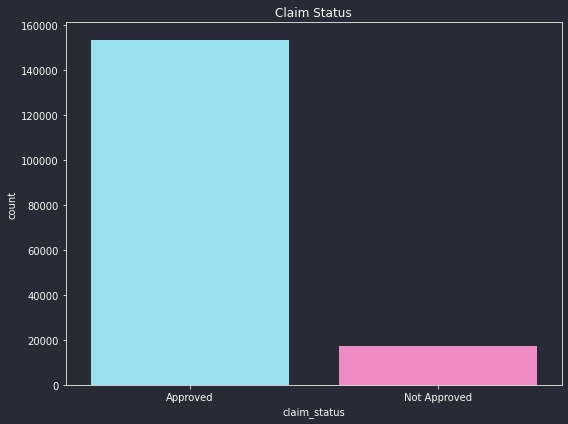


We can see the imbalance in these two categories. We'll have to consider and be cautious of this imbalance while building a claim status classifier.  
We may consider one of the following techniques(after trying all and comparing the results):  
- Oversampling
- Undersampling
- A mixture of both oversampling and undersampling


```python
# provider type
print(data.provider_type.value_counts())
plt.figure(figsize=(8,10))
sns.countplot(y=data.provider_type)
```

    Clinic                         106374
    Hospital                        15369
    Medical Clinic/ Centre           5891
    Specialist                       4868
    Medical Centre                   4681
    Health Centre                    3706
    Nursing Home                     2052
    Medical Clinic                    833
    Clinic, Level 1                   281
    Maternity And Nursing Home        241
    Primary Hospital-Category 2        85
    Dentists                           76
    Pharmacy                           30
    Radiology Unit                     15
    Name: provider_type, dtype: int64


    <AxesSubplot:xlabel='count', ylabel='provider_type'>


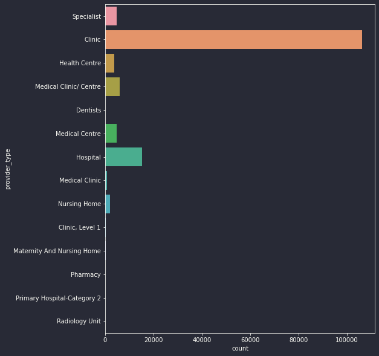


Let's correct the redundancy:


```python
data.provider_type.replace(['Medical Clinic/ Centre', 'Medical Clinic', 'Clinic, Level 1', 'Medical Centre', 'Health Centre'],
                           'Clinic', inplace=True)
data.provider_type.replace(['Nursing Home', 'Maternity And Nursing Home', 'Primary Hospital-Category 2'], 'Hospital', inplace=True)

print(data.provider_type.value_counts())
plt.figure(figsize=(8,8))
sns.countplot(y=data.provider_type)

plt.title("Provider Type")
plt.tight_layout()
plt.savefig("plots/provider type distribution.png", dpi=1000)
```

    Clinic            121766
    Hospital           17747
    Specialist          4868
    Dentists              76
    Pharmacy              30
    Radiology Unit        15
    Name: provider_type, dtype: int64


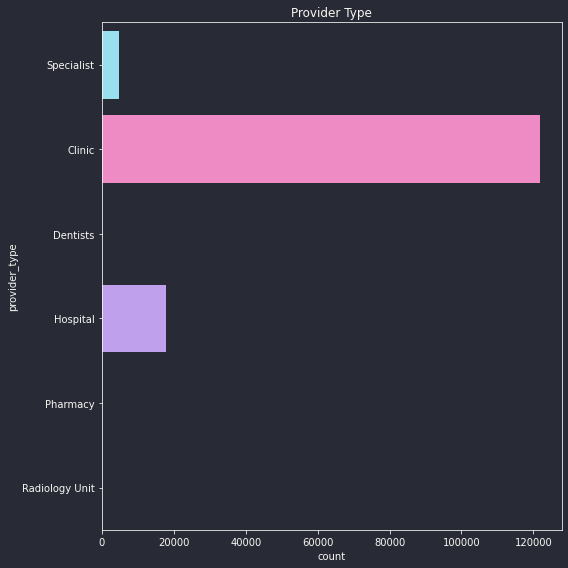


```python
# provider region
print(f"Number of regions: {data.provider_region.nunique()}\n")
print(data.provider_region.value_counts())
```

    Number of regions: 46
    
    NAIROBI            69785
    MOMBASA            15038
    KISUMU              9964
    KIAMBU              8480
    KAKAMEGA            6596
    NAKURU              4621
    BUNGOMA             4553
    KAJIADO             4206
    TRANS-NZOIA         4073
    UASIN GISHU         4033
    KISII               2954
    KERICHO             2816
    NYERI               2611
    MIGORI              2529
    MACHAKOS            2448
    KILIFI              2289
    NANDI               2198
    LAIKIPIA            2017
    MERU                1861
    GARISSA             1450
    BUSIA               1428
    SIAYA               1326
    EMBU                1297
    HOMABAY             1264
    BARINGO             1242
    KIRINYAGA           1125
    TAITA-TAVETA        1025
    KITUI                924
    TURKANA              606
    BOMET                397
    MAKUENI              383
    ISIOLO               359
    WAJIR                342
    KWALE                313
    MURANG'A\n           285
    VIHIGA               245
    NAROK                211
    WEST POKOT           137
    MARSABIT             115
    THARAKA-NITHI         86
    LAMU                  74
    NYAMIRA               60
    SAMBURU               35
    ELGEYO-MARAKWET       25
    NYANDARUA             25
    MANDERA                9
    Name: provider_region, dtype: int64


Region clearly represents counties.


```python
# correct error in MURANG'A listing
data.provider_region.replace("MURANG'A\n", "MURANG'A", inplace=True)
```


```python
# program type
data.program_type.value_counts()
```


    Insurance    170995
    Name: program_type, dtype: int64


```python
# drop the program type column as it has only one unique value
data.drop('program_type', axis=1, inplace=True)
```


```python
# program cover
data.program_cover.value_counts()
```


    OUT-PATIENT                                           124976
    OUTPATIENT                                             27489
    Outpatient                                              5243
    DENTAL                                                  4235
    OPTICAL                                                 2875
    outpatient                                              2135
    AAR - OP                                                1281
    OUT-PATIENT                                              965
    Out-Patient                                              296
    OUTPATIENT                                               223
    Dental                                                   205
    Out Patient                                              201
    ANNUAL MEDICAL CHECK-UP                                  165
    SPECTACLE FRAME                                          150
    Optical                                                  115
    BABY FRIENDLY VACCINES / WELL BABY CLINIC                 93
    OUTPATIENT                                                89
    AAR - Dental                                              51
    ANNUAL_CHECKUP                                            31
    AAR-Outpatient                                            31
    ANNUAL_CHECK-UP                                           24
    dental                                                    18
    Annual check up                                           16
    AAR- Checkup                                              15
    Well Baby Clinic                                          12
    VACCINES - PRIVATE VACCINES                               11
    AAR - Optical                                             11
    ANNUAL MEDICAL CHECK-UP FOR MAIN MEMBER / EMPLOYEE        10
    MATERNITY                                                  7
    Baby Friendly                                              5
    BABY FRIENDLY VACCINES                                     5
    AAR - Spectacle Frame                                      5
    ANNUAL MEDICAL CHECK-UP at AAR healthcare clinics          3
    optical                                                    2
    ANNUAL CHECKUP                                             2
    Name: program_cover, dtype: int64


Remove redundancy:


```python
data.program_cover.unique()
```


    array(['DENTAL', 'OUTPATIENT', 'OUT-PATIENT', 'AAR-Outpatient',
           'outpatient', 'OPTICAL', 'OUT-PATIENT ', 'Dental', 'Outpatient',
           'Annual check up', 'OUTPATIENT ', 'ANNUAL_CHECKUP', 'Out-Patient',
           'VACCINES - PRIVATE VACCINES', 'Well Baby Clinic', 'AAR - OP',
           'ANNUAL MEDICAL CHECK-UP', 'Out Patient',
           'BABY FRIENDLY VACCINES / WELL BABY CLINIC', 'OUTPATIENT   ',
           'ANNUAL MEDICAL CHECK-UP FOR MAIN MEMBER / EMPLOYEE',
           'ANNUAL_CHECK-UP', 'dental', 'MATERNITY', 'ANNUAL CHECKUP',
           'ANNUAL MEDICAL CHECK-UP at AAR healthcare clinics',
           'BABY FRIENDLY VACCINES', 'Baby Friendly', 'AAR - Dental',
           'SPECTACLE FRAME', 'Optical', 'AAR - Optical',
           'AAR - Spectacle Frame', 'optical', 'AAR- Checkup'], dtype=object)


```python
data.program_cover.replace(['OUT-PATIENT', 'AAR-Outpatient', 'outpatient', 'OUT-PATIENT ', 'Outpatient', 'OUTPATIENT ',
                           'Out-Patient', 'AAR - OP', 'Out Patient', 'OUTPATIENT   '], 'OUTPATIENT', inplace=True)
data.program_cover.replace(['Dental', 'dental', 'AAR - Dental'], 'DENTAL', inplace=True)
data.program_cover.replace(['Optical', 'AAR - Optical', 'optical', 'SPECTACLE FRAME', 'AAR - Spectacle Frame'], 'OPTICAL', inplace=True)
data.program_cover.replace(['Annual check up', 'ANNUAL_CHECKUP', 'ANNUAL MEDICAL CHECK-UP',
                            'ANNUAL MEDICAL CHECK-UP FOR MAIN MEMBER / EMPLOYEE', 'ANNUAL_CHECK-UP',
                            'ANNUAL MEDICAL CHECK-UP at AAR healthcare clinics', 'AAR- Checkup'], 'ANNUAL CHECKUP', inplace=True)
data.program_cover.replace(['VACCINES - PRIVATE VACCINES', 'Well Baby Clinic', 'BABY FRIENDLY VACCINES / WELL BABY CLINIC',
                           'MATERNITY', 'BABY FRIENDLY VACCINES', 'Baby Friendly'], 'BABY FRIENDLY', inplace=True)

data.program_cover.unique()
```


    array(['DENTAL', 'OUTPATIENT', 'OPTICAL', 'ANNUAL CHECKUP',
           'BABY FRIENDLY'], dtype=object)


```python
plt.figure(figsize=(10,8))
sns.countplot(y=data.program_cover)

plt.title("Program Cover")
plt.tight_layout()
plt.savefig("plots/program cover distribution.png", dpi=1000)
```


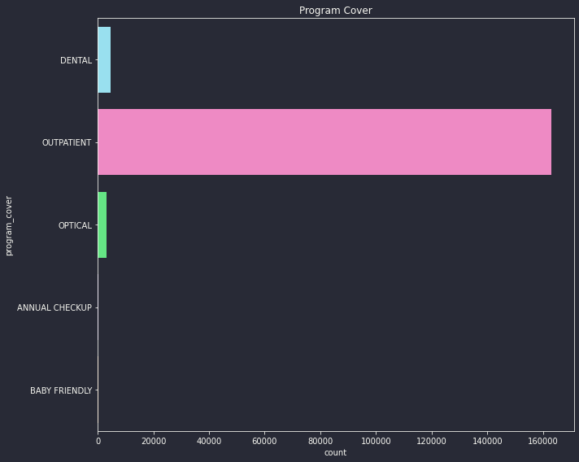


```python
# oldest participant/customer
print(f"Oldest participant is {2021 - data.participant_date_of_birth.min().year} years old\n\
Date of birth: {data.participant_date_of_birth.min()}")
```

    Oldest participant is 93 years old
    Date of birth: 1928-10-05 00:00:00


```python
# youngest
print(f"Youngest participant is {2021 - data.participant_date_of_birth.max().year} years old\n\
Date of birth: {data.participant_date_of_birth.max()}")
```

    Youngest participant is 0 years old
    Date of birth: 2021-07-01 00:00:00


```python
# save below two cells for feature engineering
# new features from DOB
```


```python
"""data['participant_yearOB'] = data.participant_date_of_birth.dt.year.astype(int)
data['participant_monthOB'] = data.participant_date_of_birth.dt.month.astype(int)
data['participant_dayOB'] = data.participant_date_of_birth.dt.day.astype(int)

data.sample(3)"""
```


    "data['participant_yearOB'] = data.participant_date_of_birth.dt.year.astype(int)\ndata['participant_monthOB'] = data.participant_date_of_birth.dt.month.astype(int)\ndata['participant_dayOB'] = data.participant_date_of_birth.dt.day.astype(int)\n\ndata.sample(3)"


```python
#data.participant_date_of_birth.dt.day_name().map({'Monday': 'weekday', 'Tuesday': 'weekday', 'Wednesday': 'weekday',
 #                                                 'Thursday': 'weekday', 'Friday': 'weekday', 'Saturday': 'weekend', 'Sunday': 'weekend'})
```


```python
# gender
print(data.participant_gender.value_counts())
plt.figure(figsize=(8,6))
sns.countplot(x=data.participant_gender)
```

    FEMALE    95751
    MALE      75238
    Name: participant_gender, dtype: int64


    <AxesSubplot:xlabel='participant_gender', ylabel='count'>


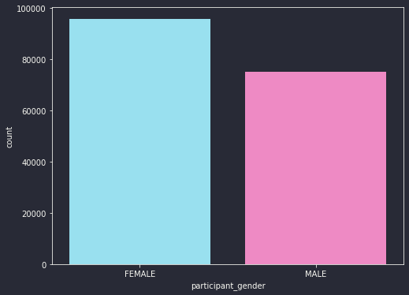


```python
# treatment date
# earliest
data.treatment_created_date.min()
```


    Timestamp('2020-12-31 01:02:12')


```python
# latest
data.treatment_created_date.max()
```


    Timestamp('2021-04-01 04:47:40')


```python
# claim finalized date
data.claim_finalized_date.min()
```


    Timestamp('2020-12-31 06:24:42')


```python
data.claim_finalized_date.max()
```


    Timestamp('2021-03-31 20:53:27')


```python
# item status
print(data.item_status.value_counts())
plt.figure(figsize=(8,6))
sns.countplot(x=data.item_status)
```

    APPROVED     152792
    SUBMITTED     16726
    REJECTED       1477
    Name: item_status, dtype: int64


    <AxesSubplot:xlabel='item_status', ylabel='count'>


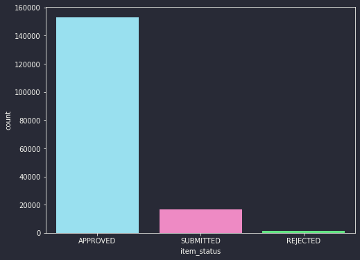


Are approved items have meaning that the claim is approved?  
Let's inspect:


```python
data.claim_status.value_counts()
```


    Approved        153549
    Not Approved     17446
    Name: claim_status, dtype: int64


Items under 'SUBMITTED' are awaiting approval or rejection.  
This is a great feature, that is if it's not a leakage feature, such that the item status is determined at the health providers prior to being pushed to the insurance company.  
To verify it's not a leakage feature let's see if there are cases where item status is rejected and claim status is approved:


```python
len(data[(data.item_status == "REJECTED") & (data.claim_status == 'Approved')])
```


    458


There are a number of such cases!  
So there is no leakage. It's either item status or claim status is determined first.


```python
# item name
data.item_name.value_counts()[:20]
```


    TOTAL CORPORATE SHARE              12977
    Consultation General Practioner    10941
    Consultation  - Specialist          2470
    Full Haemogram (FHG)                2458
    CONSULTATION FEE                    1716
    FULL BLOOD COUNT (HAEMOGRAM)        1682
    FULL HAEMOGRAM                      1509
    Consultation General Outpatient     1357
    Lenses                              1238
    Consultation                        1129
    Frames                              1093
    Revist Consultation                 1067
    C - Reactive Protein (Crp)          1064
    MALARIAL PARASITES (THIN FILM)      1052
    OUT PATIENT CLINIC CONSULTATION      810
    Consultation Paediatric Clinic       799
    Dental Consultation                  719
    Consultation - Clinical officer      713
     Urinalysis                          654
    CBC/PBF + MPS                        651
    Name: item_name, dtype: int64


Item name seems to state the reason for healthcare consultation. There also seem to be a lot of redundancy but given that the number of unique values in this column is almost 10000, it would be tedious to remove the redundancy. We can use text vectorization techniques may be, or text frequencies, after converting all text to lowercase.


```python
# item amount
sns.displot(data.item_amount)
```


    <seaborn.axisgrid.FacetGrid at 0x7f4dabdc0460>


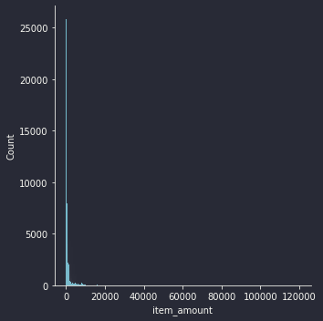


```python
sns.histplot(data.item_amount)
plt.xlim(0, 20000)
```


    (0.0, 20000.0)


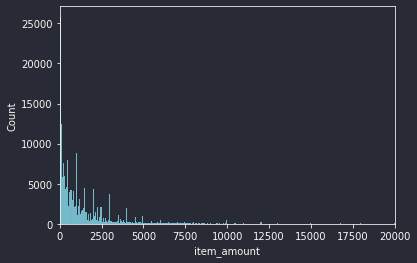


```python
# max and min amount
print(f"max: {data.item_amount.max()}\nmin: {data.item_amount.min()}")
```

    max: 120000.0
    min: 0.0


```python
# number of amounts greater than 20k
len(data[data.item_amount > 20000])
```


    517


```python
# drop item currency column since it has only one unique value
data.drop('item_currency', axis=1, inplace=True)
```


```python
# item quantity
data.item_quantity.value_counts()[:20]
```


    1     128908
    10      9962
    30      5840
    2       4372
    14      3489
    20      2795
    5       2211
    15      2109
    3       1939
    7       1467
    60      1166
    6       1060
    28       661
    18       628
    9        612
    4        538
    16       406
    21       362
    12       325
    8        272
    Name: item_quantity, dtype: int64


```python
data.diagnoses.value_counts()
```


    Encounter for administrative examination                                                                                  21769
    Encounter for examination and observation for other reasons                                                                7993
    Acute upper respiratory infection unspecified                                                                              6268
    Acute nasopharyngitis [common cold]                                                                                        3594
    Acute pharyngitis                                                                                                          3393
                                                                                                                              ...  
    Somnolence                                                                                                                    1
    Hemorrhoids and perianal venous thrombosis                                                                                    1
    Pneumonia unspecified organism; Respiratory tuberculosis unspecified                                                          1
    Hypertension; Type 2 diabetes mellitus with hyperosmolarity without nonketotic hyperglycemic-hyperosmolar coma (NKHHC)        1
    Antibody deficiency with near-normal immunoglobulins or with hyperimmunoglobulinemia                                          1
    Name: diagnoses, Length: 7112, dtype: int64


Diagnosis is another statistic that we might require to use text vectorization to be able to include this information in modeling.


```python
# drop treatment type as it has only one unique value
data.drop('treatment_type', axis=1, inplace=True)
```

## **Bivariate Analysis**
Let's explore how features relate with other features visually.


```python
data.treatment_created_date.dt.year
```


    0         2021
    1         2021
    2         2021
    3         2021
    4         2021
              ... 
    170990    2021
    170991    2021
    170992    2021
    170993    2021
    170994    2021
    Name: treatment_created_date, Length: 170995, dtype: int64


```python
# spendings over the years
plt.figure(figsize=(12,7))
sns.lineplot(x=data.treatment_created_date.dt.year, y=data.total_item_amount)
plt.title("Spendings over time")
plt.tight_layout()
plt.savefig("plots/spendings over time.png", dpi=1000)
```


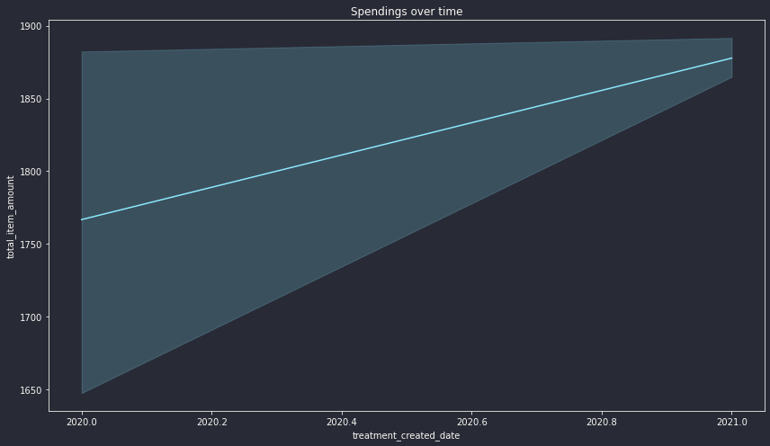


```python
# pairplot
sns.pairplot(data, hue='claim_status')
plt.suptitle("Relationship of numeric features with claim status", y=1.02)
plt.tight_layout()
plt.savefig("plots/pairplot-feature relationships with claim status.png", dpi=1000)
```


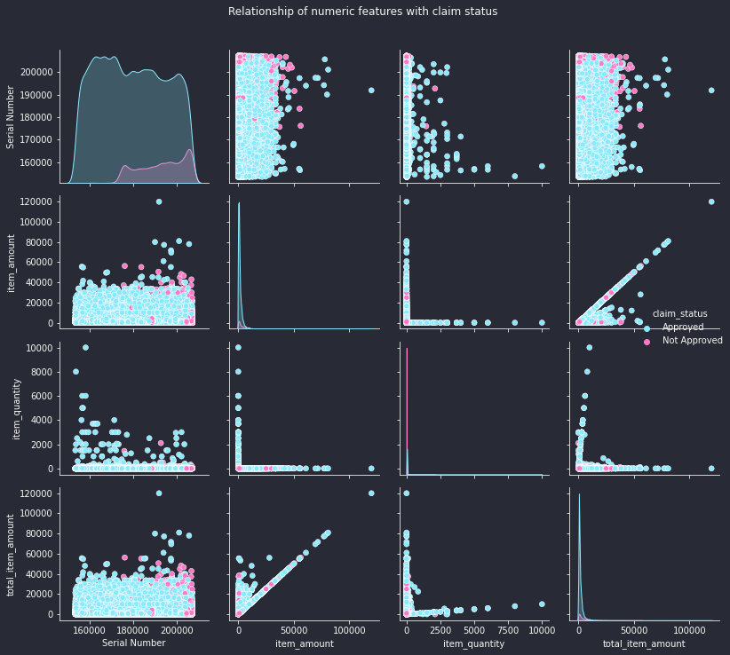


Notice how serial number can easily determine claim status.  
See how also the red dots can easily be separated from blue dots.


```python
plt.figure(figsize=(10,7))
sns.kdeplot(data['Serial Number'], hue=data.claim_status, shade='fill')
plt.title("Distribution of Serial Number in relation to claim status")
plt.tight_layout()
plt.savefig("plots/serial number distribution in relation to claim status.png", dpi=1000)
```


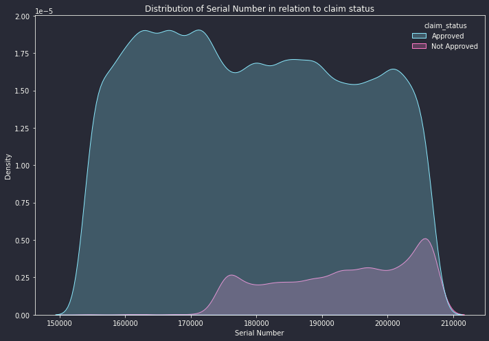


```python
sns.scatterplot(x='item_amount', y='Serial Number', data=data, hue='claim_status')
```


    <AxesSubplot:xlabel='item_amount', ylabel='Serial Number'>


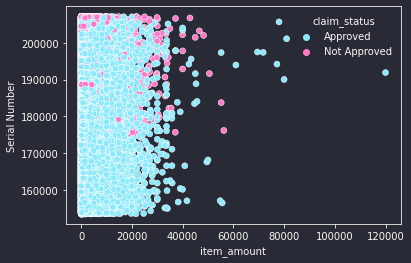


Let's see if it's easy to separate how item amount and serial number relate in relation to claim status:


```python
fig, ax = plt.subplots(1,2, figsize=(15,8))
sns.scatterplot(x='item_amount', y='Serial Number', data=data[data.claim_status == 'Approved'], hue='claim_status', ax=ax[0])
ax[0].set_xlim(0, 60000) # use same x-axis scale on both plots
sns.scatterplot(x='item_amount', y='Serial Number', data=data[data.claim_status == 'Not Approved'], ax=ax[1], color='red')
fig.suptitle("Separation of serial numbers on item amount in relation to claim status")
plt.tight_layout()
plt.savefig("plots/separation of serial numbers on item amount in relation to claim status.png", dpi=1000)
```


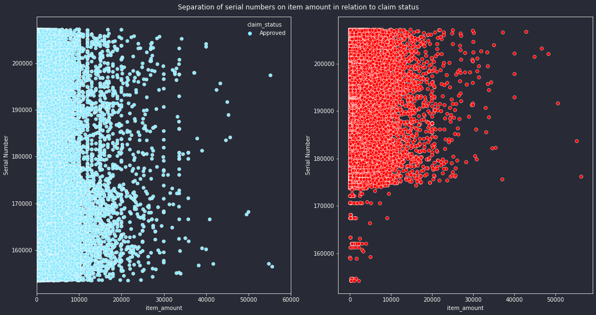


```python
# on the same plot
plt.figure(figsize=(10,7))
sns.scatterplot(x='item_amount', y='Serial Number', data=data[data.claim_status == 'Approved'], color='blue')
sns.scatterplot(x='item_amount', y='Serial Number', data=data[data.claim_status == 'Not Approved'], color='red', alpha=0.15)
fig.suptitle("Separation of serial numbers on item amount in relation to claim status")
plt.tight_layout()
plt.savefig("plots/separation of serial numbers on item amount in relation to claim status-v2.png", dpi=1000)
```


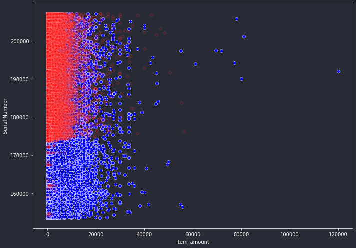


Somehow it's possible. Most unapproved claims have serial number > 174000


```python
sns.jointplot(x='item_amount', y='item_quantity', data=data, hue='claim_status')
```


    <seaborn.axisgrid.JointGrid at 0x7f4daab53670>


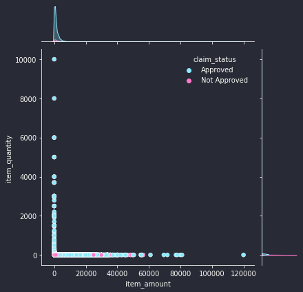


No definite relationship.


```python
# feature correlations heatmap
plt.figure(figsize=(10,6))
sns.heatmap(data.corr(), annot=True)
plt.title("Feature Correlations")
plt.tight_layout()
plt.savefig("plots/feature correlations heatmap.png", dpi=1000)
```


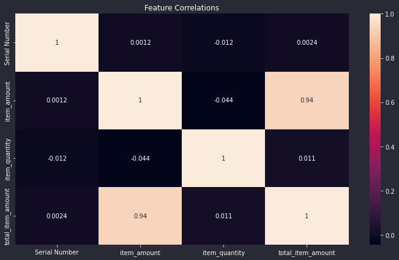


## **Outlier Detection Plots**
Boxplots and violin plots:


```python
categoricals = ['provider_type', 'program_cover', 'participant_gender', 'item_status']

for col in categoricals:
    fig, ax = plt.subplots(1,2, figsize=(15,7))
    sns.boxplot(x=col, y='total_item_amount', data=data, ax=ax[0]); sns.violinplot(x=col, y='total_item_amount', data=data, ax=ax[1])
    plt.tight_layout()
```


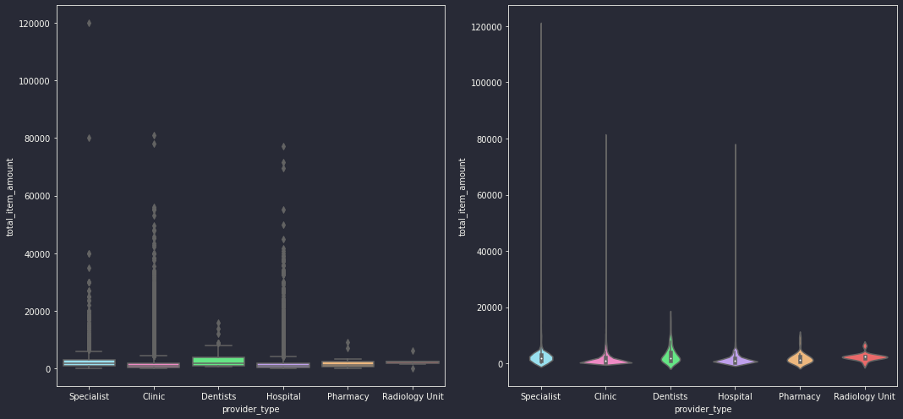


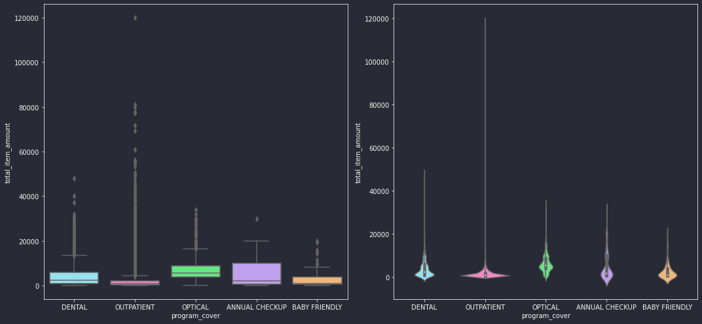


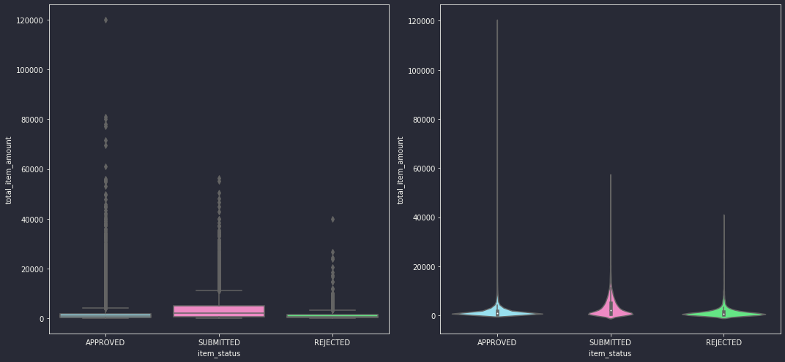


```python
for col in categoricals[:1]:
    fig, ax = plt.subplots(1,2, figsize=(15,7))
    sns.boxplot(x=col, y='Serial Number', data=data, ax=ax[0]); sns.violinplot(x=col, y='Serial Number', data=data, ax=ax[1])
    plt.tight_layout()
```


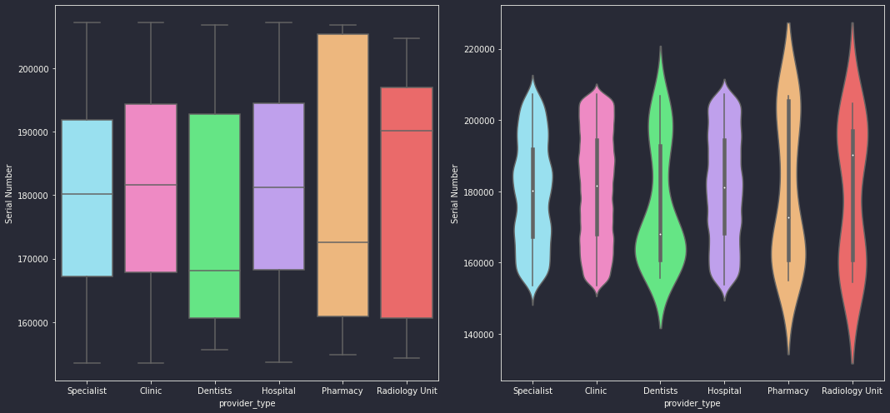


```python
# removing outliers
# drop any statistic with total item amount > 60000
data = data[data.total_item_amount < 60000]
```

## **EDA Summary**
- The column with most missing data is provider_type with 15.49% missing data points, followed by claim_finalized_date with 9.6%, rest have <3% missing data points. Visual representation in the missing data heatmap and barplot charts.
- Taking serial number as an identity column, the data represents information of 52187 customers.
- To reduce claim status to 2 most important valid categories, marked Resubmitted, Submitted, PartiallyRejected and Rejected categories as Not Approved.  
We have =~ 89.8% Approved claims and =~ 10.2% Not Approved.  
To take care of this imbalance, we might have to explore balancing techniques such as oversampling, undersampling or both.
- Corrected redundancy in provider_type column from 14 to 6 categories. See the provider type distribution chart.
- Also corrected redundancy in program_cover from =~35 to 5 categories. See program cover distribution chart.
- Participants are divided into 56% female and 44% males across gender.
- In item status column, items under 'SUBMITTED' are awaiting approval or rejection.  
Item status is a great feature, that is if it's not a leakage feature, such that the item status is determined at the health provider prior to being pushed to the insurance company (or that the claim is first decided upon, before a customer goes to the health provider).  
To test if this is a leakage feature we investigate to see if there are cases where item status is rejected and claim status is approved and see that there are a number of such cases!(458 in total)  
So we conclude there is no leakage. It's either item status or claim status is determined first.  

**MAJOR:** The Serial Number column is very determining of the claim status label. It looks like we can easily differentiate between a claim to be approved or unapproved based on it's serial number.

-----

# **Missing Data Imputation**


```python
data.isnull().sum() *100 / len(data)
```


    Serial Number                 0.394182
    claim_status                  0.000000
    provider_type                15.493576
    provider_region               1.833473
    program_cover                 0.000000
    participant_date_of_birth     0.003509
    participant_gender            0.003509
    treatment_created_date        0.000000
    claim_finalized_date          9.607748
    item_status                   0.000000
    item_name                     0.000000
    item_amount                   0.000000
    item_quantity                 0.000000
    total_item_amount             0.000000
    diagnoses                     2.800213
    dtype: float64


```python
# we can use diagnosis and item name columns to fill missing provider type information
data[data.provider_type.astype(str) == 'nan']['diagnoses'].value_counts()[:50]
```


    Encounter for administrative examination                                       3904
    Acute nasopharyngitis [common cold]                                            1170
    Acute upper respiratory infection unspecified                                  1092
    Acute pharyngitis                                                               631
    Acute tonsillitis                                                               619
    GASTRITIS, UNSPECIFIED                                                          383
    Acute laryngopharyngitis                                                        366
    Urinary tract infection site not specified                                      358
    Plasmodium falciparum malaria(uncomplicated)                                    340
    Encounter for examination and observation for other reasons                     330
    Infectious gastroenteritis and colitis unspecified                              285
    Other allergic rhinitis                                                         278
    Cough                                                                           262
    Other specified malaria                                                         239
    Peptic ulcer; site unspecified                                                  209
    Asthma                                                                          197
    Fever of other and unknown origin                                               186
    Hypertension                                                                    185
    Acute tonsillitis, unspecified                                                  172
    Encounter for Antenatal Screening of Mother                                     168
    Disease of upper respiratory tract unspecified                                  164
    Abdominal and pelvic pain                                                       161
    Diarrhoea Unspecified                                                           161
    Encounter for administrative examinations, unspecified                          159
    Essential (primary) hypertension                                                146
    Acute bronchiolitis                                                             138
    Unspecified acute lower respiratory infection                                   138
    Myalgia                                                                         131
    Other acute upper respiratory infections of multiple sites                      110
    Dental caries                                                                   108
    Infectious gastroenteritis and colitis, unspecified                             107
    Encounter for immunization                                                      103
    Migraine                                                                         99
    Soft tissue disorder unspecified                                                 98
    Other severe and complicated Plasmodium falciparum malaria (severe malaria)      97
    Urinary tract infection, site not specified                                      93
    Acute upper respiratory infections of multiple and unspecified sites             91
    Acute gastritis without bleeding                                                 84
    OTHER GASTRITIS                                                                  84
    Asthma, unspecified                                                              84
    Fever unspecified                                                                83
    Other septicaemia                                                                81
    Eczema herpeticum                                                                79
    Headache                                                                         77
    Pneumonia unspecified organism                                                   76
    Bronchitis; not specified as acute or chronic                                    73
    Low back pain (Lumbago)                                                          72
    Amoebiasis                                                                       71
    Acute pharyngitis unspecified                                                    71
    Conjunctivitis                                                                   70
    Name: diagnoses, dtype: int64


```python
data[data.provider_type.astype(str) == 'nan']['item_name'].value_counts()[:50]
```


    TOTAL CORPORATE SHARE                             3858
    Consultation General Practioner                   1570
    OUT PATIENT CLINIC CONSULTATION                    734
    Full Haemogram (FHG)                               439
    Consultation  - Specialist                         363
    Other / Unspecified                                356
    FULL BLOOD COUNT (HAEMOGRAM)                       288
    Parol 250mg/5mls syrup 100mls                      280
    CONSULTATION FEE                                   251
    Zyrtec 5mg/5mls syrup 75mls                        230
    C - Reactive Protein (Crp)                         229
    MALARIAL PARASITES (THIN FILM)                     216
    Brufen 100mg/5ml Syrup 100mls                      181
    Hrp-Clinic Consultation                            159
    Cosmol 120mg/5ml Syrup 100mls                      145
    FULL HAEMOGRAM                                     142
    PANADOL BABY AND INFANT SUSP 100ML-PD              137
    Urine Chemistry & Microscopy                       132
    Stool Microscopy-Including Concentration           125
    Consultation - Clinical officer                    120
    KARVOL INHALATION CAPS -PD                         120
    CBC/PBF + MPS                                      116
     Urinalysis                                        113
    Allerief 2mg/5mls syrup 100mls                     111
    CONSULTATION                                       105
    Revist Consultation                                102
    MALARIA ANTIGEN (RDTs- Rapid Diagnostic Tests)     100
    MALARIA FILMS & ANTIGEN                             99
    URINALYSIS                                          97
    Cetrizine 5mg/5mls syrup 60mls                      91
    Random Fasting Blood Sugar Rbs/Fbs                  90
    Random Blood Sugar                                  89
    MALARIA PARASITES (BS ) SLIDE                       89
    NASOSAL SALINE DROPS - PD                           84
    VENTOLIN INHALER 200D-PD                            84
    Peditral Satchets 1s                                79
    Montiget 4mg tablet 14s                             79
    AUGMENTIN 457MG/5ML SYRUP 70MLS                     78
    Consultation Paediatric Clinic                      78
    Betapyn Tablets                                     73
    Obstetric Ultrasound                                73
    Full blood count manual                             73
    Azithromycin 500mg capsules 3s                      71
    Zinnat 125mg/5mls syrup 100mls                      68
    Consultation General Outpatient                     66
    Salmonella Antigen test                             64
    STOOL H.PYLORI ANTIGEN                              63
    STOOL FOR OVA AND CYST                              61
    urinalysis                                          60
    Avamys nasal spray                                  60
    Name: item_name, dtype: int64


-----

Mapping diagnosis or item names containg 'consultation' to Specialist,  
those containing 'dental' to Dentists,   
those containing 'mg' or 'mls' to Pharmacy


```python
for idx in tqdm(data[data.provider_type.astype(str) == 'nan'].index):
    
    combined_text = str(data.loc[idx, 'item_name']).lower() + ' ' + str(data.loc[idx, 'diagnoses']).lower()
    
    if 'consultation' in combined_text:
        data.loc[idx, 'provider_type'] = 'Specialist'
    elif 'dental' in combined_text:
        data.loc[idx, 'provider_type'] = 'Dentists'
    elif ('mg' in combined_text) or ('mls' in combined_text):
        data.loc[idx, 'provider_type'] = 'Pharmacy'
    else:
        pass
```

      0%|          | 0/26492 [00:00<?, ?it/s]/usr/local/lib/python3.9/dist-packages/pandas/core/indexing.py:1720: SettingWithCopyWarning: 
    A value is trying to be set on a copy of a slice from a DataFrame.
    Try using .loc[row_indexer,col_indexer] = value instead
    
    See the caveats in the documentation: https://pandas.pydata.org/pandas-docs/stable/user_guide/indexing.html#returning-a-view-versus-a-copy
      self._setitem_single_column(loc, value, pi)
    100%|██████████| 26492/26492 [00:40<00:00, 658.28it/s] 


```python
data.isnull().sum() *100 / len(data)
```


    Serial Number                0.394182
    claim_status                 0.000000
    provider_type                8.012890
    provider_region              1.833473
    program_cover                0.000000
    participant_date_of_birth    0.003509
    participant_gender           0.003509
    treatment_created_date       0.000000
    claim_finalized_date         9.607748
    item_status                  0.000000
    item_name                    0.000000
    item_amount                  0.000000
    item_quantity                0.000000
    total_item_amount            0.000000
    diagnoses                    2.800213
    dtype: float64


We have managed to go from 15% missing data points to just 8%.


```python
# Fill the rest with a new category 'unknown'
data.provider_type.fillna('unknown', inplace=True)
```

    /usr/local/lib/python3.9/dist-packages/pandas/core/series.py:4463: SettingWithCopyWarning: 
    A value is trying to be set on a copy of a slice from a DataFrame
    
    See the caveats in the documentation: https://pandas.pydata.org/pandas-docs/stable/user_guide/indexing.html#returning-a-view-versus-a-copy
      return super().fillna(


```python
# Filling diagnoses with item name
for idx in tqdm(data[data.diagnoses.astype(str) == 'nan'].index):
    data.loc[idx, 'diagnoses'] = data.loc[idx, 'item_name']
```

    100%|██████████| 4788/4788 [00:17<00:00, 272.50it/s]


```python
len(data[data.claim_finalized_date.dt.date == data.treatment_created_date.dt.date])
```


    35439


```python
# over 35000 treatment created dates have same day with claim finalized date
# filling claim finalized date with treatment created date
for idx in tqdm(data[data.claim_finalized_date.astype(str) == 'NaT'].index):
    data.loc[idx, 'claim_finalized_date'] = data.loc[idx, 'treatment_created_date']
```

    100%|██████████| 16428/16428 [00:26<00:00, 617.86it/s]


```python
data.isnull().sum() *100 / len(data)
```


    Serial Number                0.394182
    claim_status                 0.000000
    provider_type                0.000000
    provider_region              1.833473
    program_cover                0.000000
    participant_date_of_birth    0.003509
    participant_gender           0.003509
    treatment_created_date       0.000000
    claim_finalized_date         0.000000
    item_status                  0.000000
    item_name                    0.000000
    item_amount                  0.000000
    item_quantity                0.000000
    total_item_amount            0.000000
    diagnoses                    0.000000
    dtype: float64


```python
len(data) - len(data.dropna())
```


    3815


```python
# drop the rest few nans and save clean 
data.dropna(inplace=True)
data.reset_index(drop=True, inplace=True)

data.to_csv("data/data_clean.csv", index=False)
```

    <ipython-input-73-16dad88e8740>:2: SettingWithCopyWarning: 
    A value is trying to be set on a copy of a slice from a DataFrame
    
    See the caveats in the documentation: https://pandas.pydata.org/pandas-docs/stable/user_guide/indexing.html#returning-a-view-versus-a-copy
      data.dropna(inplace=True)

